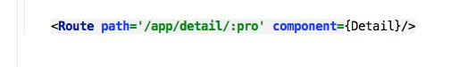
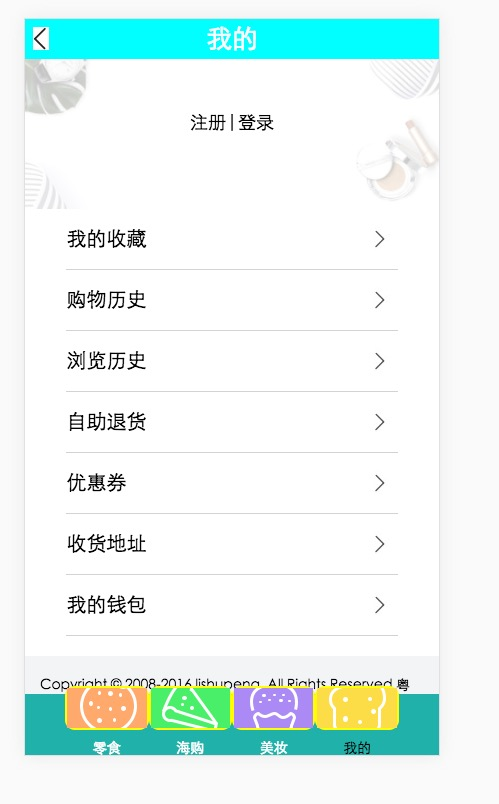

#react-router-demo  后期会不断优化

``1 npm install``

``2 node server或者 npm run start``

``3 打开浏览器 输入 localhost:3200``

``实现路由逻辑的是entry.js``

``路由手动添加是utils.js里的 navTo这个方法，在各个模块的跳转中均由体现``

``路由配置的时候要注意参数路由的写法以及在组件中如何获取参数路由``

``component中public文件中是页面公用的部分  footer  和  header``

``实现正确的逻辑包括注册登陆  但是注册登陆都没有进行校验处理  本次修改并且做了点击注册或者登陆然后路由也会进行跳转  其中的图片如下所示``

``登陆页面``

``注册页面``

``首页``

``找回密码页``

``我的  其中的各按钮的点击路由已经配置好  但是没有跳转配置以及跳转的组件 后期会逐渐加上``

``以及其他的二级页，点击上面的返回首页就会默认返回到首页``

``商品详情页  详情页的选项卡已经配置好  点击即可实现效果``

