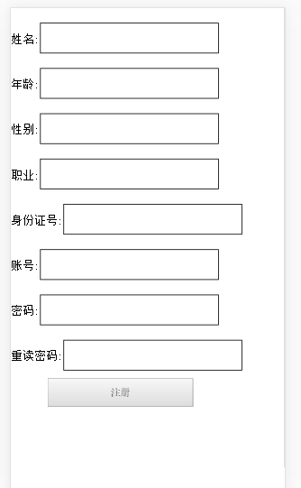
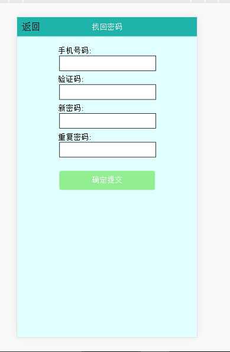

#react-router-demo  后期会不断优化

``1 npm install``

``2 node server或者 npm run start``

``3 打开浏览器 输入 localhost:3200``

``实现路由逻辑的是entry.js``

``路由手动添加是utils.js里的 navTo这个方法，在各个模块的跳转中均由体现``

``component中public文件中是页面公用的部分  footer  和  header``

``实现正确的逻辑包括注册登陆  但是注册登陆都没有进行校验处理  本次修改并且做了点击注册或者登陆然后路由也会进行跳转  其中的图片如下所示``

``登陆页面``

``注册页面``

``首页``

``找回密码页``

``以及其他的二级页，点击上面的返回首页就会默认返回到首页``

