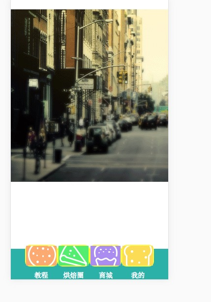

#react-router-demo

``1 npm install``
``2 node server或者 npm run start``
``3 打开浏览器 输入 localhost:3200``

``实现路由逻辑的是entry.js``

``component中public文件中是页面公用的部分  footer  和  header``
``header  footer``

``点击BACK返回会默认跳转到我们的首页``
 